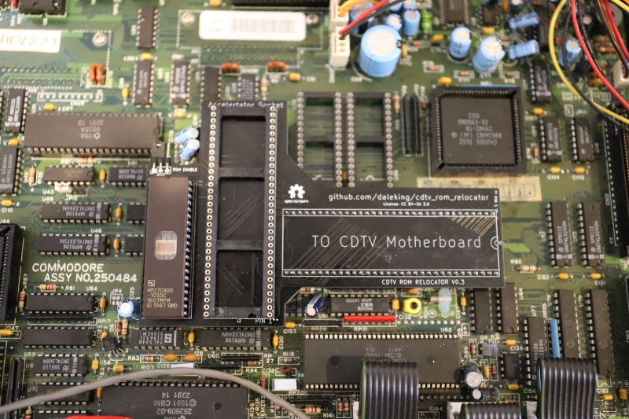
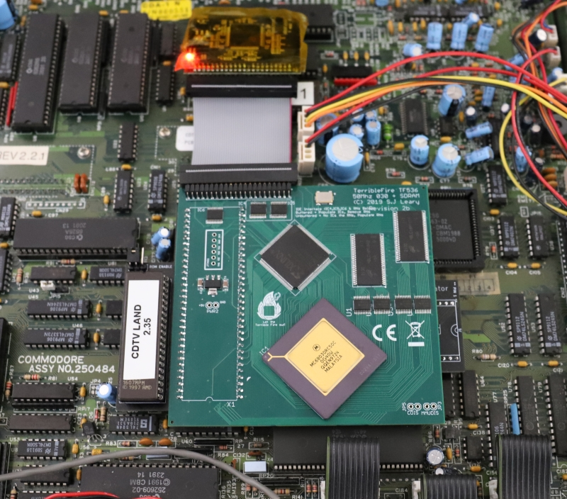
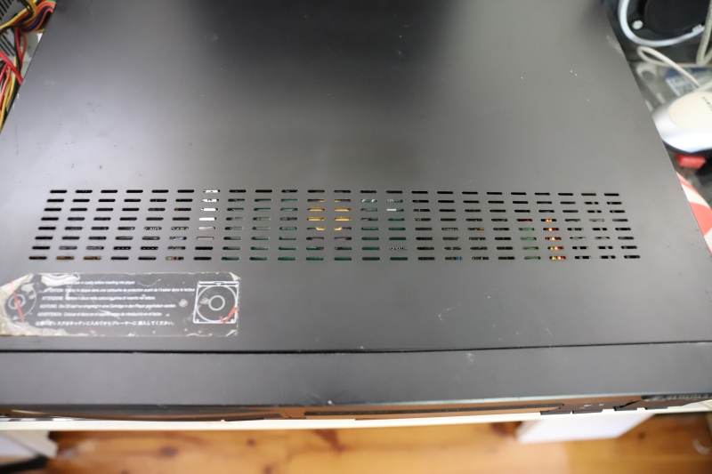
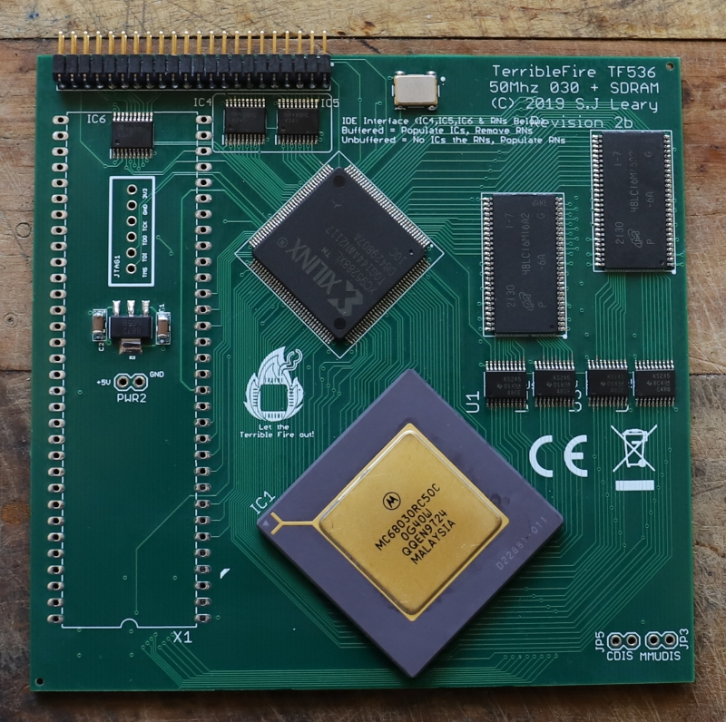
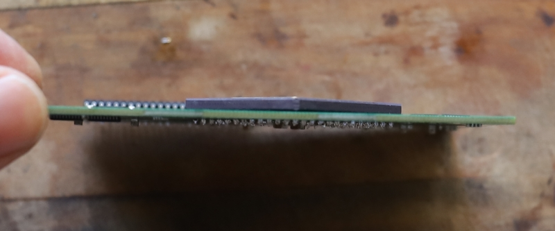
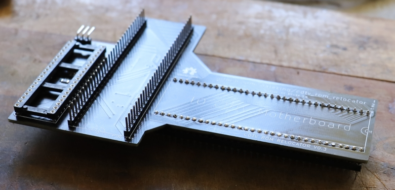
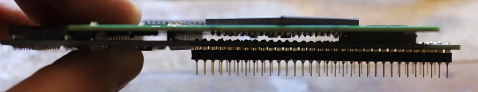
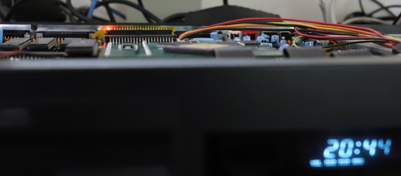

# CDTV Extended ROM and CPU Relocator

I wanted to use a single 27C400 for the extended ROM in my CDTV because 2x
27C1000's are a pain.  A single socket for the rom also makes debugging easier
because I can use a single flashed based rom.  This means I can easily pop in
[CDTV Land's replacement ROM](https://cdtvland.com/os235/) and easily burn or
test future updates.

The second goal was to relocate the CPU socket in such a way to allow an
accelerator such as a TF536 or 020-TK to be installed without interferring with
caps and in such a way that by soldering everything together the case for the
CDTV could still be closed.

Hence the CDTV ROM Relocator was born.  It's a simple relocator with some
decoding logic for the extended ROM and a jumper to disable/enable the rom
(since JP15 on the motherboard only drives logic to the motherboard roms).

By trimming the CPU pins and soldering together a sandwich, the case can be
closed.

If you want to build one you can try the [gerbers from
here](CDTV_Reromlocator/gerbers_v3.zip).

## Photos

This is the bare relocator with an empty 68000 socket.  Installing the original
68000 will still work and the case can still be closed.

**Note!**  If you install a socket for the accelerator you will likely not be able
to close the case.  I recommend soldering the accelerator directly to the
relocator but please do this at your own risk!

Here we have an installed TF536 and CDTV OS 2.35 on a single 27C400.

Case closed!  The tallest component is the ROM, which still has a mm or two
before it touches the case.

We'll need an accelerator.  I like the TF536 with the [firmware from
here](https://www.exxoshost.co.uk/forum/viewtopic.php?f=76&t=3542&sid=06fe9e624b3ed6e35e5968cf34cc0226&start=30#p70123)
which disables the flashy boot rom on the TF536 (that is in the same address
space as the extended ROM).

You will also want a right angled IDE header, not a straight one.  This means
the cable connector is nice and flat.

You will want to solder down and trim the legs of your CPU.  In hindsight I
would raise the CPU of the board by a few mm and just solder the leads short.
There is enough height left for the CPU to sit a little proud but please do
test fit before soldering.

I used regular pin strips between the relocator board and the TF536.  The
plastic at the bottom is the height I chose as a safe distance between the two
PCBs.

Here they are just before soldering together.  Check there is nothing that will
short.  I used a bit of cardboard to keep everything spaced nicely and as a bit
of extra protection in case the boards got smooshed by the case.

Testing installed height.  In my case the ROM is the tallest component.  You
could try and find a lower profile DIP socket for the ROM.

